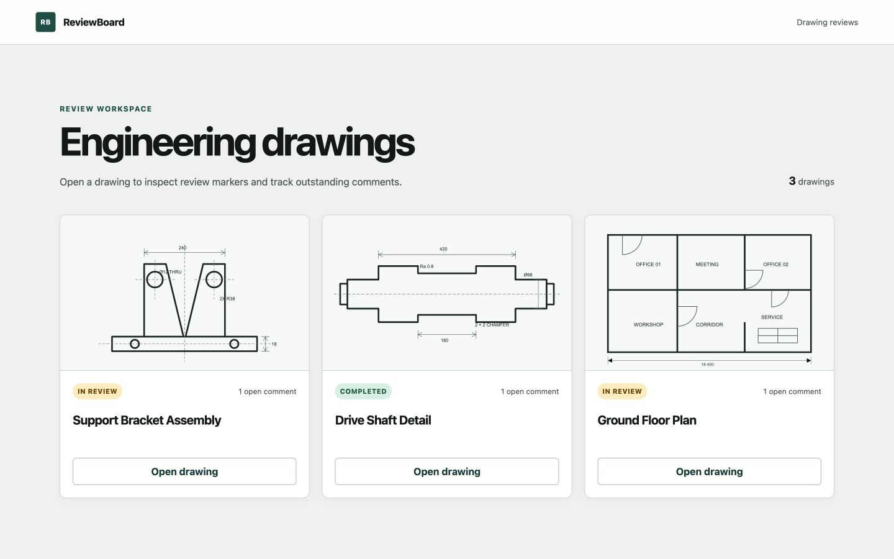
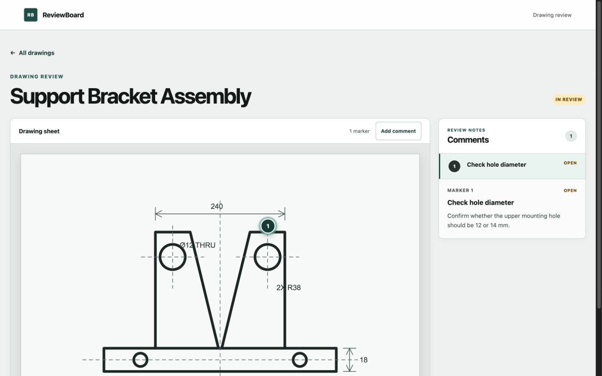
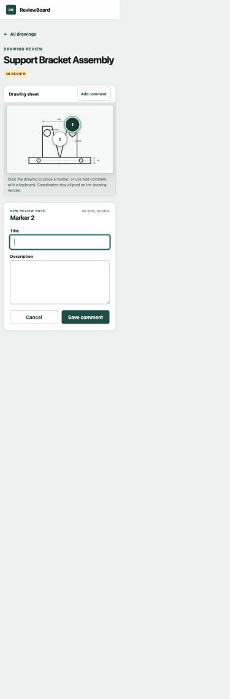
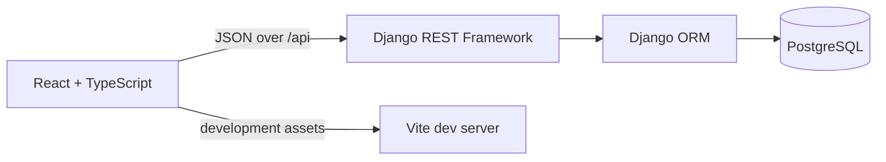

# ReviewBoard

ReviewBoard is a full-stack portfolio project for reviewing engineering drawings. Reviewers can open seeded drawings, place percentage-positioned markers, add structured comments, and inspect review notes in a responsive, keyboard-accessible workspace.



## Highlights

- Responsive React and TypeScript interface built with Vite
- Django REST Framework API backed by PostgreSQL
- Click-to-place markers that remain aligned while drawings resize
- Transaction-safe, per-drawing marker numbering
- Comment validation, retryable errors, cancellation, and deliberate focus management
- Desktop drawing-plus-sidebar layout and stacked tablet/mobile workspace
- Accessible labels, focus indicators, status text, and touch targets
- Repeatable demo-data seeding and automated frontend/backend tests

## Screenshots

### Drawing review workspace



<details>
<summary>Mobile comment form</summary>



</details>

## Architecture



The frontend uses route-level components and local React state. A small typed API module owns `fetch` calls, while drawing, marker, form, and comment-list components remain focused on presentation and interaction. This keeps the data flow explicit without introducing a global state library for a two-route MVP.

The backend exposes resource-oriented endpoints through Django REST Framework. Model constraints and serializer validation protect coordinate and status values. Comment creation locks the parent drawing inside a database transaction before assigning the next marker number, preventing two simultaneous requests from receiving the same number.

### Repository layout

```text
backend/
  config/               Django project settings and root URLs
  reviews/              Models, serializers, API views, tests, and seed command
frontend/
  public/demo-drawings/ Seed drawing assets
  src/api/              Typed API boundary
  src/components/       Reusable viewer, marker, form, and card components
  src/pages/            Dashboard and drawing-review routes
  src/test/             Shared frontend test setup
docs/screenshots/       Portfolio screenshots used by this README
```

## Local setup

### Prerequisites

- Node.js 20 or newer
- npm
- Python 3.11 or newer
- PostgreSQL

### 1. Configure the environment

From the repository root:

```bash
cp .env.example .env
```

The example uses local-only development values. Change the secret and database credentials for any shared environment.

Create the matching PostgreSQL role and database:

```sql
CREATE USER reviewboard WITH PASSWORD 'reviewboard';
CREATE DATABASE reviewboard OWNER reviewboard;
```

### 2. Start the API

```bash
cd backend
python3 -m venv .venv
source .venv/bin/activate
python -m pip install -r requirements.txt
python manage.py migrate
python manage.py seed_demo_data
python manage.py runserver
```

The API is served at `http://127.0.0.1:8000/api/`. The health check is `GET /api/health/`.

### 3. Start the frontend

In a second terminal:

```bash
cd frontend
npm install
npm run dev
```

Open `http://localhost:5173`. Vite proxies `/api` to `http://127.0.0.1:8000` by default. To use another API origin, copy `frontend/.env.example` to `frontend/.env.local` and change `VITE_API_TARGET`.

## API

| Method | Endpoint | Purpose |
| --- | --- | --- |
| `GET` | `/api/health/` | Check API availability |
| `GET` | `/api/drawings/` | List drawings with open-comment counts |
| `GET` | `/api/drawings/{id}/` | Retrieve one drawing |
| `GET` | `/api/drawings/{id}/comments/` | List comments belonging to a drawing |
| `POST` | `/api/drawings/{id}/comments/` | Create an open, sequentially numbered comment |
| `GET` | `/api/comments/{id}/` | Retrieve one comment |
| `PATCH` | `/api/comments/{id}/` | Update comment content or status |
| `DELETE` | `/api/comments/{id}/` | Delete one comment |

Create-comment request:

```json
{
  "title": "Check hole diameter",
  "description": "Confirm whether this should be 12 or 14 mm.",
  "x_position": 62.0,
  "y_position": 28.5
}
```

The API assigns `drawing`, `marker_number`, `status`, and timestamps. Coordinates must be between `0` and `100`; new comments are always created with `OPEN` status.

## Tests and checks

Frontend tests use Vitest, jsdom, and Testing Library. They cover coordinate conversion, marker selection, form focus and validation, Escape cancellation, request payloads, and immediate interface updates after saving.

```bash
cd frontend
npm test
npm run typecheck
npm run build
```

Backend tests cover drawing counts, drawing-scoped comment lists, validation, sequential numbering, status updates, deletion, missing resources, and repeatable seed data.

```bash
cd backend
source .venv/bin/activate
python manage.py check
python manage.py test
```

## Manual QA checklist

1. Open the dashboard and confirm all seeded cards, statuses, and open-comment counts load.
2. Open a drawing and select comments from both the numbered markers and comment list.
3. Click the drawing and confirm the temporary marker follows the click position.
4. Submit an empty form and verify both validation messages and title focus.
5. Cancel with the button and with `Escape`; confirm the draft disappears and focus returns to **Add comment**.
6. Create a valid comment and confirm its marker, list item, detail, and count update without a reload.
7. Visit an unknown drawing URL and confirm the not-found state links back to the dashboard.
8. Repeat at desktop, tablet, and mobile widths; check for horizontal overflow and visible keyboard focus.

## Tradeoffs and future work

- **Seeded assets instead of uploads:** drawing files are static demo assets, keeping the portfolio setup small. Production use would need object storage, upload validation, and document versioning.
- **Local state instead of a client cache:** two routes and a small API surface do not justify Redux or a query library. More editing workflows would benefit from cache invalidation and optimistic updates.
- **Percentage coordinates:** this is simple and responsive for a single rendered image. Zooming, panning, rotation, multi-page drawings, or PDF coordinates would need a dedicated viewport transform.
- **Database locking for numbering:** row locking is reliable with PostgreSQL and keeps numbering server-owned. At much higher write volume, a dedicated sequence strategy could reduce contention.
- **No authentication or real-time collaboration:** the MVP demonstrates the review workflow. Production use would require users, permissions, audit history, and WebSocket or polling updates.
- **Drawing status is explicit:** comment status changes do not automatically change the drawing status; a future workflow should define who owns that transition.
